# 🔐 Diagramas de Flujo de Autenticación - Hera.BFF

## 📋 Índice
1. [Autenticación con Credenciales (Username/Password)](#autenticación-con-credenciales)
2. [Autenticación con SAML](#autenticación-con-saml)
3. [Flujo Unificado de Sesión](#flujo-unificado-de-sesión)

---

## 🔑 Autenticación con Credenciales

### Diagrama de Actividades UML

```mermaid
sequenceDiagram
    participant F as Frontend<br/>(Browser)
    participant A as Azure APIM
    participant B as Hera.BFF<br/>(AuthController)
    participant H as LoginCommand<br/>Handler
    participant AS as Hera.Authentication<br/>(/User/login)
    participant R as Redis/MongoDB<br/>(Session Storage)
    
    Note over F,R: Flujo de Login con Credenciales
    
    F->>F: Usuario ingresa<br/>username/password
    F->>A: POST /api/auth/login<br/>{username, password}
    
    Note over A: Validación APIM
    A->>A: ✅ Validar rate limit
    A->>A: ✅ Validar CORS
    A->>A: ✅ Log request
    
    A->>B: POST /api/auth/login<br/>{username, password}
    
    Note over B: BFF AuthController
    B->>B: Validar request
    B->>H: Send LoginCommand<br/>(via MediatR)
    
    Note over H: Command Handler
    H->>AS: POST /User/login<br/>{username, password, callbackUrl}
    
    Note over AS: Hera.Authentication Logic
    AS->>AS: Validar credenciales
    
    alt Es dominio admin (@admin.com)
        AS->>AS: AuthenticateAdmin()
        AS->>AS: Generar JWT token
    else Es dominio externo
        AS->>AS: RedirectToIDP()
        Note over AS: Llamada a IDP externo
        AS->>AS: Obtener token del IDP
        AS->>AS: Validar respuesta IDP
        AS->>AS: Generar JWT token
    end
    
    alt Autenticación exitosa
        AS-->>H: 200 OK<br/>{token, refreshToken, expiresIn}
        
        Note over H: Procesar respuesta
        H->>H: Decodificar JWT<br/>Extraer userId
        H->>H: Crear objeto Session:<br/>- SessionId = GUID<br/>- AccessToken = JWT<br/>- RefreshToken<br/>- UserId<br/>- ExpiresAt
        
        H->>R: CreateAsync(session)
        R-->>H: Session guardada ✅
        
        H-->>B: LoginResult<br/>{sessionId, userId}
        
        Note over B: Configurar Cookie
        B->>B: Set-Cookie:<br/>hera_session={sessionId}<br/>HttpOnly; Secure; SameSite=Lax
        
        B-->>A: 200 OK<br/>{success: true}<br/>+ Set-Cookie header
        A-->>F: 200 OK<br/>{success: true}<br/>+ Cookie
        
        F->>F: Cookie guardada<br/>automáticamente
        F->>F: Redirigir a /dashboard
        
    else Credenciales inválidas
        AS-->>H: 401 Unauthorized<br/>{error: "Invalid credentials"}
        H->>H: Throw UnauthorizedException
        H-->>B: UnauthorizedException
        B-->>A: 401 Unauthorized<br/>{error: "Invalid credentials"}
        A-->>F: 401 Unauthorized
        F->>F: Mostrar error
    end
```

### Diagrama de Estado


---

## 🔐 Autenticación con SAML

### Diagrama de Actividades UML

```mermaid
sequenceDiagram
    participant F as Frontend<br/>(Browser)
    participant A as Azure APIM
    participant B as Hera.BFF<br/>(AuthController)
    participant H as InitiateSAMLLogin<br/>Handler
    participant AS as Hera.Authentication<br/>(/saml/login)
    participant IDP as SAML Identity<br/>Provider
    participant CB as CompleteLogin<br/>Handler
    participant R as Redis/MongoDB<br/>(Session Storage)
    
    Note over F,R: Fase 1: Iniciar SAML Login
    
    F->>F: Usuario hace clic<br/>"Login with SAML"
    F->>A: GET /api/auth/saml/login
    A->>B: GET /api/auth/saml/login
    
    B->>H: Send InitiateSAMLLoginCommand<br/>(via MediatR)
    
    H->>AS: GET /saml/login?returnUrl={bffCallback}
    
    Note over AS: Generar SAML Request
    AS->>AS: Crear SAML AuthnRequest
    AS->>AS: Firmar request
    AS-->>H: 302 Redirect<br/>Location: {IDPUrl}?SAMLRequest={...}
    
    H-->>B: RedirectResult
    B-->>A: 302 Redirect
    A-->>F: 302 Redirect a IDP
    
    Note over F,IDP: Fase 2: Autenticación en IDP
    
    F->>IDP: GET /sso?SAMLRequest={...}
    
    Note over IDP: Usuario se autentica
    IDP->>IDP: Mostrar login page
    F->>IDP: POST credentials
    IDP->>IDP: Validar credenciales
    IDP->>IDP: Generar SAML Response
    IDP->>IDP: Firmar SAML Response
    
    Note over F,R: Fase 3: SAML Callback
    
    IDP-->>F: 302 Redirect<br/>POST form con SAMLResponse
    
    F->>A: POST /api/auth/callback<br/>{SAMLResponse, RelayState}
    A->>B: POST /api/auth/callback<br/>{SAMLResponse, RelayState}
    
    B->>CB: Send CompleteLoginCommand<br/>(SAMLResponse, RelayState)
    
    Note over CB: Validar y procesar SAML
    CB->>AS: POST /saml/acs<br/>{SAMLResponse}
    
    Note over AS: Validar SAML Response
    AS->>AS: Verificar firma
    AS->>AS: Validar timestamp
    AS->>AS: Extraer atributos<br/>(userId, email, nombre)
    AS->>AS: Generar JWT token
    
    AS-->>CB: 200 OK<br/>{token, refreshToken, expiresIn, userInfo}
    
    Note over CB: Crear Sesión
    CB->>CB: Extraer userId del JWT
    CB->>CB: Crear objeto Session:<br/>- SessionId = GUID<br/>- AccessToken = JWT<br/>- RefreshToken<br/>- UserId<br/>- ExpiresAt
    
    CB->>R: CreateAsync(session)
    R-->>CB: Session guardada ✅
    
    CB-->>B: LoginResult<br/>{sessionId, userId}
    
    Note over B: Configurar Cookie
    B->>B: Set-Cookie:<br/>hera_session={sessionId}<br/>HttpOnly; Secure
    
    B-->>A: 302 Redirect /dashboard<br/>+ Set-Cookie header
    A-->>F: 302 Redirect<br/>+ Cookie
    
    F->>F: Cookie guardada
    F->>F: Navegar a /dashboard
```

### Diagrama de Estado SAML

```mermaid
stateDiagram-v2
    [*] --> NoAutenticado: Usuario en login page
    
    NoAutenticado --> IniciandoSAML: Click "Login with SAML"
    
    IniciandoSAML --> RedirigidoAIDP: BFF genera SAML Request
    
    RedirigidoAIDP --> AutenticandoEnIDP: Usuario en IDP login page
    
    AutenticandoEnIDP --> SAMLResponseGenerada: Credenciales válidas
    AutenticandoEnIDP --> ErrorIDP: Credenciales inválidas
    
    SAMLResponseGenerada --> ValidandoSAMLResponse: POST a BFF callback
    
    ValidandoSAMLResponse --> GenerandoJWT: SAML Response válida
    ValidandoSAMLResponse --> ErrorSAML: SAML Response inválida
    
    GenerandoJWT --> CreandoSesion: JWT generado
    
    CreandoSesion --> Autenticado: Session en Redis/MongoDB
    
    Autenticado --> [*]: Sesión activa
    ErrorIDP --> NoAutenticado: Reintentar
    ErrorSAML --> NoAutenticado: Reintentar
```



---

## 🔄 Flujo Unificado de Sesión

### Diagrama de Actividades Post-Login

```mermaid
flowchart TD
    Start([Usuario Autenticado<br/>Cookie: hera_session])
    
    Start --> MakeRequest[Hacer Request<br/>GET /api/proxy/management/users/1]
    
    MakeRequest --> APIM[Azure APIM]
    
    APIM --> RateLimit{Rate Limit<br/>OK?}
    RateLimit -->|No| RateLimitError[429 Too Many Requests]
    RateLimit -->|Sí| ForwardToBFF
    
    ForwardToBFF[Forward a BFF] --> ProxyController[ProxyController<br/>Recibe Request]
    
    ProxyController --> ExtractCookie[Extraer SessionId<br/>de Cookie]
    
    ExtractCookie --> HasCookie{Cookie<br/>existe?}
    HasCookie -->|No| Unauthorized[401 Unauthorized]
    
    HasCookie -->|Sí| QuerySession[Consultar Session<br/>en Redis/MongoDB<br/>FindOneAsync(BySessionId)]
    
    QuerySession --> SessionExists{Session<br/>existe?}
    SessionExists -->|No| SessionNotFound[401 Session Not Found]
    
    SessionExists -->|Sí| CheckExpiry{Token<br/>expirado?}
    
    CheckExpiry -->|Sí, expirado| RefreshToken[Refresh Token<br/>con Hera.Authentication]
    
    RefreshToken --> RefreshSuccess{Refresh<br/>exitoso?}
    RefreshSuccess -->|No| RefreshFailed[401 Token Expired]
    RefreshSuccess -->|Sí| UpdateSession[Actualizar Session<br/>con nuevo token]
    
    UpdateSession --> ProxyRequest
    CheckExpiry -->|No| ProxyRequest
    
    ProxyRequest[Proxy Request a<br/>Hera.Management<br/>+ Bearer JWT]
    
    ProxyRequest --> Management[Hera.Management<br/>valida JWT]
    
    Management --> ManagementResponse{Response<br/>OK?}
    
    ManagementResponse -->|Error| ErrorResponse[Error Response<br/>a Frontend]
    ManagementResponse -->|OK| UpdateLastAccess[Actualizar<br/>LastAccessedAt]
    
    UpdateLastAccess --> SuccessResponse[Success Response<br/>a Frontend]
    
    SuccessResponse --> End([Fin])
    ErrorResponse --> End
    Unauthorized --> End
    SessionNotFound --> End
    RefreshFailed --> End
    RateLimitError --> End
```

---

## 📊 Comparación de Flujos

| Aspecto | Credenciales | SAML |
|---------|-------------|------|
| **Inicio** | POST /api/auth/login | GET /api/auth/saml/login |
| **Datos enviados** | username + password | Ninguno (redirect) |
| **Validación** | Hera.Authentication (IDP opcional) | SAML IDP (obligatorio) |
| **Redirects** | 0 (respuesta directa) | 2-3 (IDP y callback) |
| **Complejidad** | ⭐⭐ Baja | ⭐⭐⭐⭐ Alta |
| **Resultado final** | Cookie hera_session | Cookie hera_session |
| **Session storage** | Redis/MongoDB | Redis/MongoDB |
| **JWT visible** | ❌ No (en BFF) | ❌ No (en BFF) |

---

## 🎯 Puntos Clave Comunes

### Ambos flujos comparten:

1. ✅ **Frontend nunca ve el JWT token**
   - Credenciales: Token va de Hera.Auth → BFF → Redis/MongoDB
   - SAML: Token va de Hera.Auth → BFF → Redis/MongoDB

2. ✅ **Cookie httpOnly como identificador**
   - Credenciales: Cookie set después de login exitoso
   - SAML: Cookie set después de callback

3. ✅ **Session almacenada server-side**
   - Credenciales: CreateAsync(session) en Redis/MongoDB
   - SAML: CreateAsync(session) en Redis/MongoDB

4. ✅ **Request subsequentes usan el mismo flujo**
   - Ambos: Cookie → Session → JWT → Proxy

5. ✅ **Azure APIM en el frente**
   - Ambos: Rate limiting, CORS, logging por APIM

---

## 🔐 Diagrama de Componentes


---

## 📝 Resumen

### **Flujo de Credenciales:**
1. Frontend → APIM → BFF `/api/auth/login`
2. BFF → Hera.Auth `/User/login`
3. Hera.Auth → JWT token → BFF
4. BFF → Session en Redis/MongoDB
5. BFF → Cookie al Frontend
6. ✅ Usuario autenticado

### **Flujo SAML:**
1. Frontend → APIM → BFF `/api/auth/saml/login`
2. BFF → Hera.Auth → Redirect a IDP
3. Usuario autentica en IDP
4. IDP → SAML Response → BFF `/api/auth/callback`
5. BFF → Hera.Auth valida SAML → JWT token
6. BFF → Session en Redis/MongoDB
7. BFF → Cookie al Frontend
8. ✅ Usuario autenticado

### **Requests Subsecuentes:**
1. Frontend → APIM → BFF (+ Cookie)
2. BFF → Query Session (usando Specification)
3. BFF → Obtener JWT de Session
4. BFF → Proxy a Hera.Management (+ JWT)
5. Hera.Management → Response
6. BFF → Response al Frontend

---

**Todos los caminos llevan a la misma sesión segura!** 🔐✨
